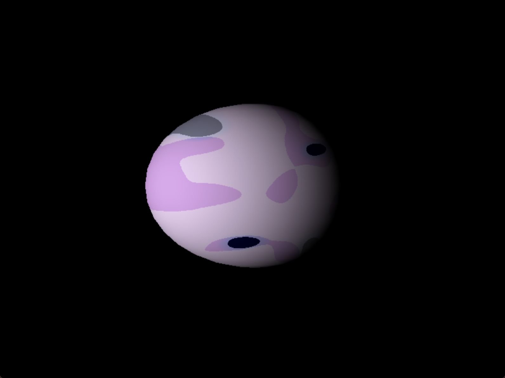
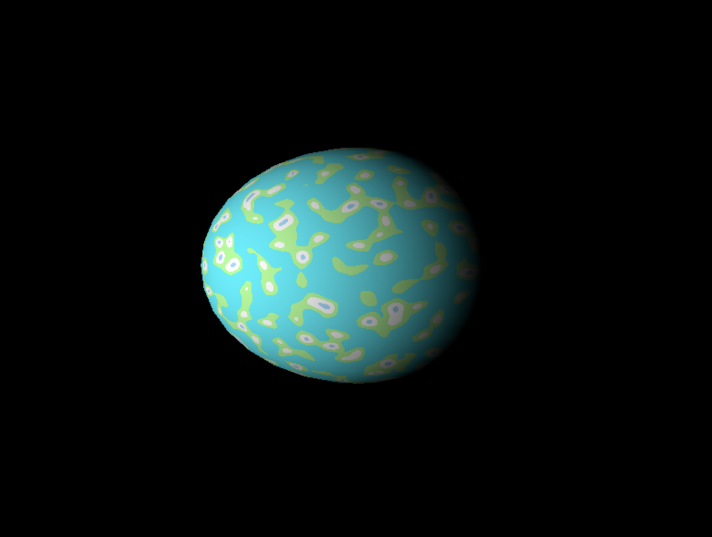
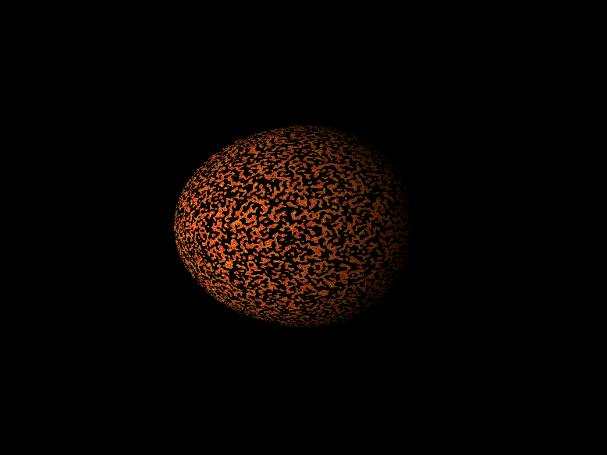
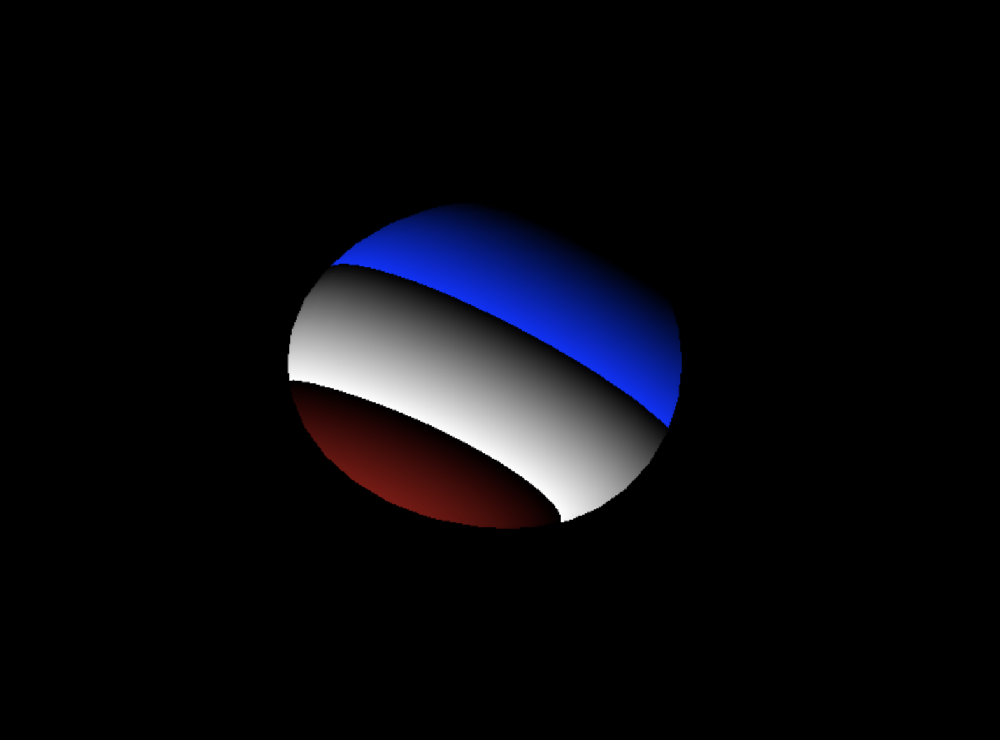
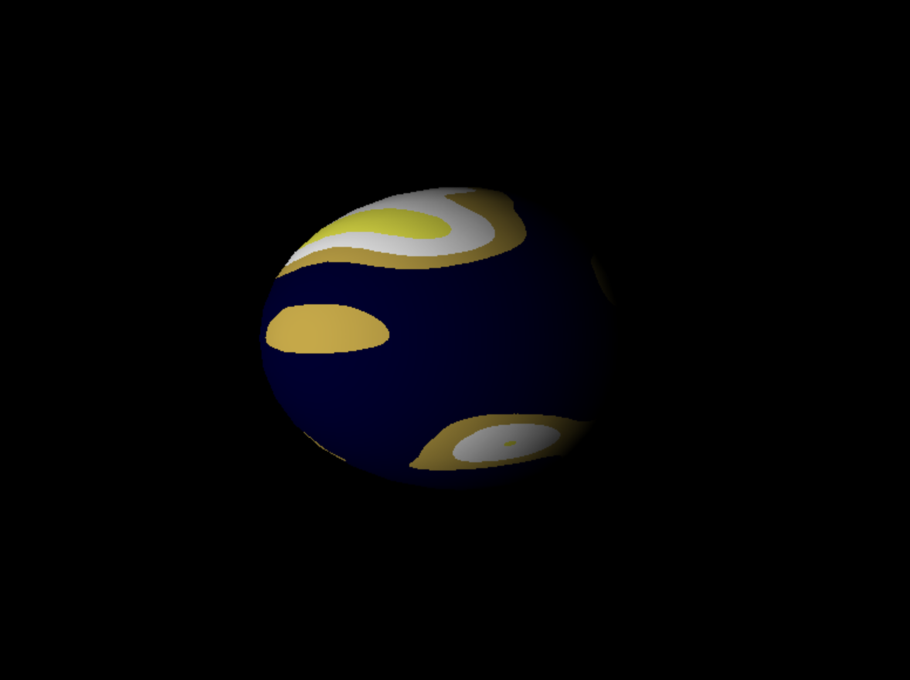
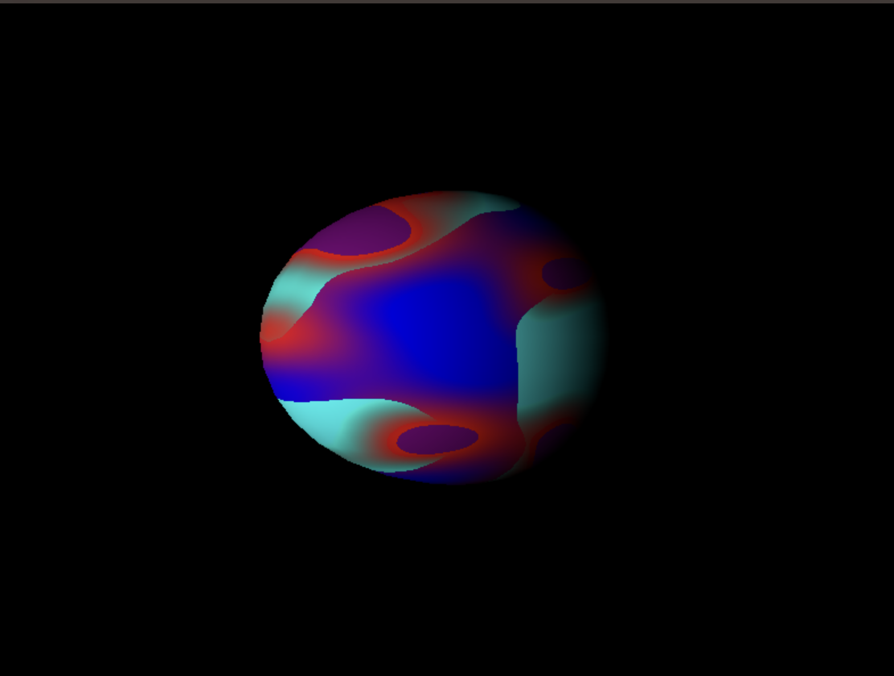

# CG-LAB4
Laboratory #4 - Computer Graphics

## Images of the different plantes

### Planeta Gaseoso


### Planeta Rocoso


### Estrella


### Planeta Random 1 Pelota de Tripa de Coche


### Planeta Random 2 Mar con Islas de Panqueque y huevo estrellado



### Planeta Random 3 (Planeta congelado con volcanes rojos)


### To Choose a planet change the selectedPlanet value on shaders.h file
```c++
// Selected Planet
int selectedPlanet = 0;
```
