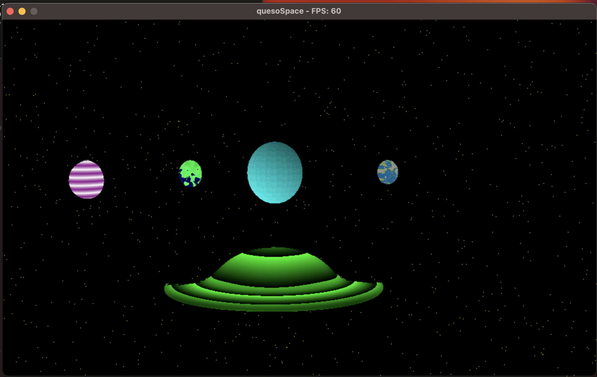
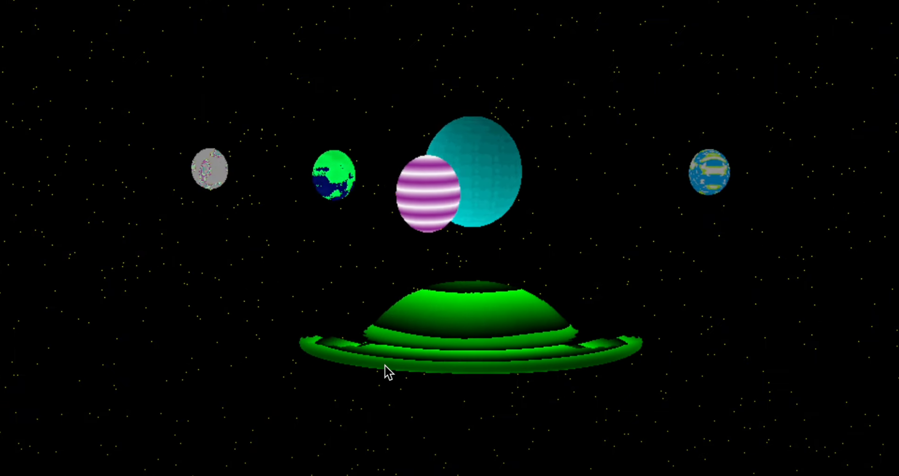

# CG-PR1
Project #1 - Computer Graphics

# Explicación
- El proyecto consiste en la renderización en tiempo real de un sistema solar de 1 estrella y 4 planetas. Los cuerpos celestes están alineados en un plano eclíptico.
- Los planetas tienen traslación y rotación propia.
- Se implementó una nave espacial que sigue a la cámara, y la cámara se puede mover en 6 direcciones (arriba, abajo, adelante, atras, izquierda y derecha).
- Se implementó un skybox que muestra estrellas en el horizonte.

# Controles
- wasd: mover la nave
- flechas: mover la camara

# Lenguaje
- C++

# Instrucciones para correr
- Configurar con `zsh configure.sh`
- Compilar con `zsh build.sh`
- Correr con `zsh run.sh`

# Rúbrica
- [x] (0 a 30 puntos) [Criterio subjetivo] Por la estética de su sistema completo
   - **Razón:** 30/30 si esta bello jejeje

- [x] (0 a 20 puntos) [Criterio subjetivo] Por el rendimiento de la escena completa. No es necesario mantener 60 frames por segundo, es suficiente con que se sienta apropiado.
   - **Razón:** Llega hasta a 220 fps, y siempre tiene como minimo 60 fps

- [x] (0 a 50 puntos) 10 Puntos por cada planeta / estrella / luna en el sistema.
   - **Razón:** 50/50, hay 4 planetas y 1 estrella

- [ ] (0 a 10 puntos) 10 Puntos por implementar instant warping a diferentes puntos del sistema solar
   - **Razón:** no hay

- [ ] (0 a 10 puntos) 10 Puntos más si el efecto está animado
   - **Razón:** no hay

- [x] (0 a 30 puntos) 30 Puntos por renderizar una nave modelada por ustedes que siga a su cámara
   - **Razón:** si hay nave y sigue a la camara hasta con efecto de rotación

- [x] (0 a 10 puntos) 10 puntos por crear un skybox que muestre estrellas en el horizonte
   - **Razón:** si hay, estrellas amarillas

- [ ] (0 a 10 puntos) 10 puntos por implementar condicionales que eviten que la nave/cámara atraviese los elementos de su sistema solar
   - **Razón:** no hay

- [x] (0 a 40 puntos) 40 puntos por implementar movimiento 3D para la cámara
   - **Razón:** se mueve arriba, abajo, adelante, atras, izquierda y derecha (6 movimientos), eso cuenta como 3D? solo falta diagonal que se puede apachando 2 teclas a la vez

- [ ] (0 a 20 puntos) 20 puntos por renderizar las órbitas de los planetas
   - **Razón:** no hay 

   **Total de puntos: 180**

## Showcase

- [Video de Juego](https://youtu.be/MrbUTDu08Pc)
- 
- 

